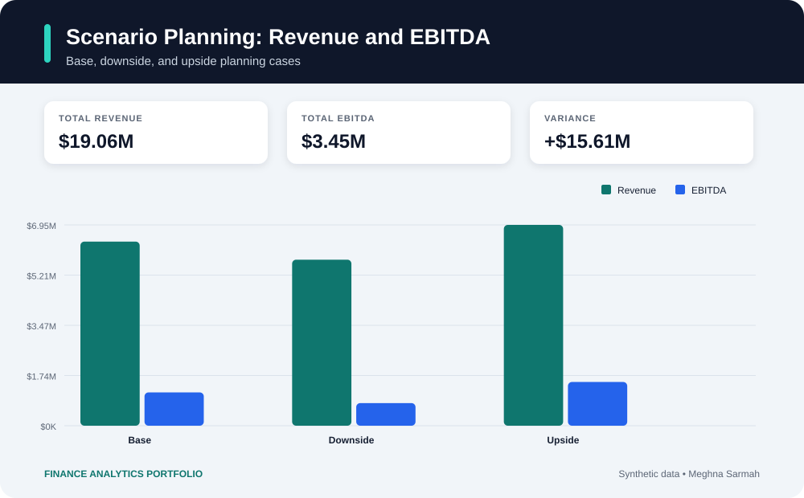

# FP&A Budget and Rolling Forecast Model

An end-to-end FP&A model that converts monthly operating assumptions into a 12-month income statement, compares actuals with budget, and creates base, upside, and downside scenarios.

## Scenario visualization



## Business problem

Leadership needs one repeatable view of revenue, gross margin, operating expenses, EBITDA, and variance drivers. This project demonstrates how a finance analyst can consolidate assumptions, update forecasts, and surface risks early.

## What the model does

- Builds monthly revenue from volume and pricing assumptions
- Forecasts COGS and operating expenses
- Calculates gross margin, EBITDA, and budget variance
- Produces base, upside, and downside scenarios
- Exports a management-ready summary CSV

## Run

```bash
pip install pandas
python forecast_model.py
```

## Key outputs

- Monthly budget versus forecast
- Revenue and EBITDA variance
- Scenario comparison
- Full-year management summary

This project uses synthetic data and is intended for portfolio demonstration.

## Planning methodology

The model begins with operational drivers rather than simply applying a percentage increase to historical results. Monthly unit volume, selling price, COGS percentage, and operating expense assumptions flow through a structured income statement. This allows Finance to explain not only what changed, but which assumption caused the movement.

## Scenario logic

- **Base case:** management's current operating assumptions
- **Downside case:** lower volume and weaker margin performance
- **Upside case:** stronger demand, pricing, and operating leverage

Each scenario uses the same calculation structure, making the results comparable and reducing the risk of inconsistent offline models.

## Findings

- Base-case revenue is approximately **$6.37M**, generating **$1.15M of EBITDA**.
- The downside scenario reduces EBITDA to approximately **$782K**, highlighting sensitivity to volume and gross margin.
- The upside case generates approximately **$1.51M of EBITDA**, around **$357K above the reference budget**.

## Management use

The outputs can support monthly forecast reviews, annual planning, lender reporting, hiring decisions, and cost-management conversations. A finance analyst can update the assumption file, rerun the model, and use the scenario summary to explain the revised outlook.

## Repository structure

- **monthly_assumptions.csv** — monthly business drivers
- **forecast_model.py** — forecast and scenario calculations
- **monthly_forecast.csv** — detailed monthly income statement
- **scenario_summary.csv** — full-year scenario comparison

## Skills demonstrated

Budgeting, rolling forecasts, driver-based planning, variance analysis, scenario modeling, Python, pandas, and executive communication.
